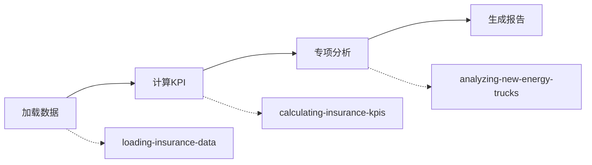

# 保险业务分析 Skills 目录

> **项目**: 车险周报生成系统
> **版本**: v2.0
> **更新**: 2025-11-04

## 📁 Skills 概览

本项目包含3个核心skills，遵循Claude Skills最佳实践，采用渐进式披露架构。

| Skill | 功能 | 状态 | 行数 |
|-------|------|------|------|
| [analyzing-new-energy-trucks](#analyzing-new-energy-trucks) | 新能源货车专项分析 | ✅ 生产就绪 | ~200 |
| [loading-insurance-data](#loading-insurance-data) | 保险数据加载预处理 | ✅ 生产就绪 | ~150 |
| [calculating-insurance-kpis](#calculating-insurance-kpis) | KPI计算和评估 | 🚧 计划中 | - |

---

## 🎯 analyzing-new-energy-trucks

### 功能描述

专项分析新能源货车保险业务数据，识别高风险机构和业务类型。

### 何时使用

- 分析新能源货车承保数据
- 评估电池风险和充电基础设施影响
- 识别高赔付率机构和业务组合
- 生成新能源货车风险评估报告

### 结构

```
analyzing-new-energy-trucks/
├── SKILL.md                           # 主技能文件
├── scripts/
│   └── analyze_new_energy_trucks.py  # 完整分析脚本
└── reference/
    ├── kpi_definitions.md            # KPI定义
    └── risk_thresholds.md            # 风险阈值标准
```

### 快速开始

```python
from analyze_new_energy_trucks import NewEnergyTruckAnalyzer

analyzer = NewEnergyTruckAnalyzer("2025年保单", 28, 43)
available_weeks, missing = analyzer.load_data()
weekly_kpis = analyzer.calculate_weekly_kpis()
report = analyzer.generate_report(...)
```

### 关键特性

- ✅ 多周趋势分析
- ✅ 机构风险分级（6档）
- ✅ 业务类型深度钻取
- ✅ 异常波动自动检测
- ✅ 专业markdown报告生成

---

## 📊 loading-insurance-data

### 功能描述

加载并预处理保险保单周度数据，支持智能周期检测和数据验证。

### 何时使用

- 开始任何保险数据分析任务
- 需要加载多周历史数据
- 进行数据质量检查
- 多年度数据整合分析

### 结构

```
loading-insurance-data/
├── SKILL.md                      # 主技能文件
├── scripts/
│   ├── quick_load.py            # 快速加载工具
│   └── data_validator.py        # 数据验证工具
└── reference/
    ├── data_schema.md           # 字段说明
    └── data_quality_rules.md    # 质量标准
```

### 快速开始

```python
# 检测可用周次
weeks = detect_available_weeks("2025年保单")

# 加载数据
data = {}
for week in weeks:
    df = load_week_data(week)
    data[week] = preprocess_data(df)
```

### 关键特性

- ✅ 智能周期检测
- ✅ 自动数据清洗
- ✅ 数据质量验证
- ✅ 多年度支持
- ✅ 编码错误处理

---

## 📈 calculating-insurance-kpis

### 功能描述

计算保险业务核心KPI指标，进行状态评估和趋势分析。

### 何时使用

- 计算赔付率、费用率等核心指标
- 评估业务健康状况
- 进行周度/月度趋势分析
- 生成KPI仪表板

### 状态

🚧 **计划中** - 将在下一版本实现

### 预期功能

- 核心KPI自动计算
- 智能状态判断
- 趋势分析算法
- 异常值检测

---

## 🔄 Skills 工作流

典型的分析工作流程：



### 示例代码

```python
# 1. 加载数据 (loading-insurance-data)
weeks = detect_available_weeks("2025年保单")
data = {w: load_week_data(w) for w in weeks[28:44]}

# 2. 计算KPI (calculating-insurance-kpis)
for week, df in data.items():
    kpis = calculate_kpis(df)
    print(f"第{week}周赔付率: {kpis['loss_ratio']:.2f}%")

# 3. 专项分析 (analyzing-new-energy-trucks)
analyzer = NewEnergyTruckAnalyzer("2025年保单", 28, 43)
analyzer.load_data()
weekly_kpis = analyzer.calculate_weekly_kpis()
report = analyzer.generate_report(...)

# 4. 保存报告
with open("周报/新能源货车分析_第28-43周.md", "w") as f:
    f.write(report)
```

---

## 📚 参考文档

### 通用参考

- [KPI定义](analyzing-new-energy-trucks/reference/kpi_definitions.md) - 所有指标的计算公式
- [风险阈值](analyzing-new-energy-trucks/reference/risk_thresholds.md) - 风险分级标准
- [数据架构](loading-insurance-data/reference/data_schema.md) - 字段说明

### 最佳实践

- [Claude Skills最佳结构](../开发文档/Claude%20skills最佳结构.md)
- [Skills最佳实例](../开发文档/skills最佳实例.md)
- [项目完成总结](../V2.0_项目完成总结.md)

---

## 🛠️ 工具脚本

### 数据分析脚本

| 脚本 | 功能 | 位置 |
|------|------|------|
| `analyze_new_energy_trucks.py` | 新能源货车完整分析 | `analyzing-new-energy-trucks/scripts/` |
| `quick_load.py` | 快速数据加载 | `loading-insurance-data/scripts/` |
| `data_validator.py` | 数据质量检查 | `loading-insurance-data/scripts/` |

### 独立脚本

| 脚本 | 功能 | 位置 |
|------|------|------|
| `generate_report_v2.py` | V2.0完整报告生成器 | 项目根目录 |
| `generate_report.py` | V1.0报告生成器（遗留） | 项目根目录 |

---

## 🚀 快速上手

### 环境准备

```bash
# 确保安装必要的Python包
pip install pandas numpy

# 检查数据文件
ls 2025年保单/*保单第*周*.csv | wc -l
```

### 运行分析

```bash
# 方式1: 使用独立脚本
python3 analyze_new_energy_trucks.py

# 方式2: 在Python中调用
python3 -c "
from analyze_new_energy_trucks import NewEnergyTruckAnalyzer
analyzer = NewEnergyTruckAnalyzer('2025年保单', 28, 43)
analyzer.load_data()
print('分析完成')
"
```

---

## 📊 数据要求

### 文件格式

- **格式**: CSV (UTF-8-SIG编码)
- **命名**: `{年份}保单第{周次}周变动成本明细表.csv`
- **位置**: `{年份}年保单/` 目录

### 必需字段

| 字段 | 类型 | 说明 |
|------|------|------|
| `policy_year` | int | 保单年度 (2024/2025) |
| `third_level_organization` | str | 三级机构名称 |
| `business_type_category` | str | 业务类型（含"货车"） |
| `is_new_energy_vehicle` | bool | 是否新能源 |
| `signed_premium_yuan` | float | 签单保费 |
| `matured_premium_yuan` | float | 满期保费 |
| `reported_claim_payment_yuan` | float | 已报告赔款 |
| `policy_count` | int | 保单件数 |
| `claim_case_count` | int | 赔案件数 |

---

## 🎯 使用建议

### 新用户

1. 从 `loading-insurance-data` 开始，熟悉数据结构
2. 使用 `analyzing-new-energy-trucks` 跑一次完整分析
3. 查看生成的markdown报告，理解输出格式
4. 参考 `reference/` 目录中的文档理解指标

### 高级用户

1. 直接修改脚本参数（周期、阈值等）
2. 扩展分析维度（增加新的业务类型）
3. 自定义报告模板
4. 集成到自动化工作流

---

## 🔧 故障排除

### 常见错误

| 错误信息 | 原因 | 解决方案 |
|---------|------|---------|
| `FileNotFoundError` | 数据文件不存在 | 检查文件路径和命名 |
| `UnicodeDecodeError` | 编码问题 | 使用 `encoding='utf-8-sig'` |
| `KeyError: column` | 缺少必需字段 | 检查CSV文件结构 |
| `Memory Error` | 数据量过大 | 分批加载或只读必要列 |

### 获取帮助

1. 查看对应skill的 `SKILL.md` 文档
2. 参考 `reference/` 目录中的详细说明
3. 检查脚本中的注释和docstring
4. 查看项目根目录的 `开发纪要.md`

---

## 📝 更新日志

### v2.0 (2025-11-04)

**新增**:
- ✨ 创建 `analyzing-new-energy-trucks` skill
- ✨ 创建 `loading-insurance-data` skill
- ✨ 添加完整的参考文档体系
- ✨ 实用工具脚本集成

**改进**:
- 📝 遵循Claude Skills最佳实践
- 📝 渐进式披露架构
- 📝 精简主文件至<500行
- 📝 模块化参考文档

**文档**:
- 📚 完整的KPI定义文档
- 📚 详细的风险阈值标准
- 📚 数据架构说明
- 📚 故障排除指南

---

## 📄 许可与贡献

- **项目**: 内部工具
- **维护**: 保险数据团队
- **联系**: 通过项目Git仓库提交Issue

---

**最后更新**: 2025-11-04
**文档版本**: 2.0
**Skills总数**: 3 (2个生产就绪, 1个计划中)
