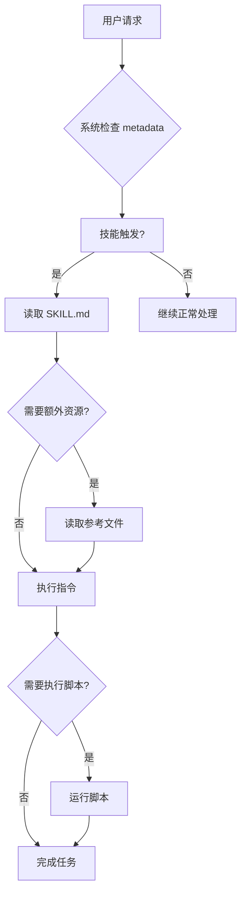

# 🏗️ Claude Skills 最佳结构指南

> **版本**: v2.0  
> **更新**: 2025-11-04  
> **作者**: Claude AI  

## 📋 基本结构要求

每个 Skill 必须包含一个 `SKILL.md` 文件，使用 YAML frontmatter 格式：

```yaml
---
name: skill-name
description: "清晰描述这个 skill 的功能和使用场景"
---

# Skill 主体内容
## 指令和指南
```

---

## 🎯 三层架构设计

Claude skills 采用渐进式披露的三层架构：

| 层级 | 加载时机 | 内容类型 | Token 成本 | 示例 |
|-----|---------|----------|------------|------|
| **Level 1** | 始终加载 | 元数据 | ~100 tokens | name, description |
| **Level 2** | 触发时加载 | 主要指令 | <5K tokens | SKILL.md 主体 |
| **Level 3** | 需要时加载 | 资源代码 | 无限制 | 脚本、参考文件 |

---

## 📁 目录结构模式

### 1. 简单结构（单文件）

```
my-skill/
└── SKILL.md
```

**适用场景**：基础指令类 skill  
**示例**：品牌指南、写作规范

---

### 2. 中等结构（多文件参考）

```
insurance-analyzer/
├── SKILL.md          # 主要指令
├── reference/
│   ├── kpis.md      # KPI 定义
│   └── thresholds.md # 阈值标准
└── examples/
    └── report_template.md
```

**适用场景**：需要参考文档的复杂分析  
**示例**：保险分析、财务报告

---

### 3. 复杂结构（含可执行代码）

```
document-processor/
├── SKILL.md          # 核心指令
├── scripts/
│   ├── validate.py  # 验证脚本
│   ├── convert.py   # 转换脚本
│   └── analyze.py   # 分析脚本
├── templates/
│   └── output_template.html
└── reference/
    ├── api_docs.md
    └── best_practices.md
```

**适用场景**：需要工具脚本的技能  
**示例**：PDF 处理、Excel 分析、MCP 集成

---

## 📝 YAML Frontmatter 规范

### 必需字段

```yaml
---
name: skill-name                    # 必需：技能名称
description: "功能描述和使用场景"    # 必需：详细描述
---
```

### 字段要求

**name**：
- 最大 64 字符
- 仅限小写字母、数字、连字符
- 不能包含 XML 标签
- 保留词限制（anthropic, claude）

**description**：
- 最大 1024 字符
- 必须非空
- 不能包含 XML 标签
- 需包含功能和使用时机

### 最佳实践示例

```yaml
---
name: insurance-new-energy-analyzer
description: "分析新能源货车保险业务数据，识别高风险机构和业务类型。在处理新能源货车承保数据、风险评估报告或制定承保策略时使用。"
---
```

---

## 🔧 SKILL.md 内容结构

### 标准模板

```markdown
# 技能名称

## 核心功能
简要描述技能的主要能力

## 立即使用
```python
# 快速开始代码示例
function_example()
```

## 详细指南

### 子功能 1
详细说明...

### 子功能 2
详细说明...

## 实用脚本
```bash
# 有用脚本示例
python scripts/tool.py --input=file
```

## 注意事项
- 重要提示 1
- 重要提示 2
```

---

## 🛠️ 资源文件组织

### 脚本目录（`scripts/`）

```bash
scripts/
├── data_validation.py    # 数据验证工具
├── report_generator.py   # 报告生成器
├── analysis_engine.py    # 分析引擎
└── visualization.py      # 可视化工具
```

**设计原则**：
- ✅ 确定性操作使用脚本
- ✅ 复杂算法封装为函数
- ✅ 错误处理必须完善
- ✅ 输出格式标准化

### 参考文档（`reference/`）

```
reference/
├── kpis.md              # KPI 定义
├── thresholds.md        # 阈值标准
├── methodologies.md     # 方法论
└── best_practices.md    # 最佳实践
```

**设计原则**：
- ✅ 按需加载，避免冗余
- ✅ 内容模块化组织
- ✅ 交叉引用清晰
- ✅ 版本控制友好

### 模板资源（`templates/`）

```
templates/
├── report_template.html     # 报告模板
├── email_template.md        # 邮件模板
└── dashboard_template.json  # 仪表盘模板
```

**设计原则**：
- ✅ 标准化输出格式
- ✅ 可配置参数化
- ✅ 响应式设计
- ✅ 品牌一致性

---

## ⚙️ 渐进式加载机制

### 加载流程图



### 实际加载示例

```bash
# Claude 实际执行的命令序列
bash: read insurance-analyzer/SKILL.md
# → 加载主要指令

bash: read insurance-analyzer/reference/kpis.md
# → 按需加载 KPI 定义

bash: python insurance-analyzer/scripts/calculate_metrics.py data.csv
# → 执行脚本（仅输出进入上下文）
```

---

## 🔍 结构复杂度选择指南

| 复杂度 | 结构类型 | 适用场景 | 示例 |
|--------|----------|----------|------|
| **简单** | 单文件 | 基础指令、标准规范 | 品牌指南、写作规范 |
| **中等** | 多文档 | 流程指导、参考信息 | 分析报告、业务流程 |
| **复杂** | 完整工具链 | 专业工具、企业应用 | PDF 处理、MCP 集成、数据分析 |

---

## 📊 文件命名和组织最佳实践

### 命名规范

```bash
# ✅ Good examples
insurance-claim-analyzer/     # 保险理赔分析器
document-processor/           # 文档处理器
mcp-enterprise-integrator/    # MCP 企业集成器

# 文件命名
SKILL.md                      # 必须大写
calculate_metrics.py         # 小写下划线
KPITemplate.html            # 驼峰命名
api-reference.md            # 连字符分隔
```

### 组织原则

1. **逻辑分组**：相关功能放在一起
2. **层级清晰**：避免过深嵌套
3. **加载优化**：常用内容放前面
4. **版本友好**：易于 diff 和合并
5. **文档完整**：每个目录都有 README

---

## 🎯 实战案例：保险分析 Skill 结构

### 项目结构示例

```
insurance-analytics-suite/
├── SKILL.md                          # 主技能文件
├── scripts/
│   ├── data_loader.py               # 数据加载器
│   ├── kpi_calculator.py            # KPI 计算器
│   ├── trend_analyzer.py            # 趋势分析器
│   └── report_generator.py          # 报告生成器
├── reference/
│   ├── insurance_kpis.md            # 保险 KPI 定义
│   ├── risk_thresholds.md           # 风险阈值标准
│   ├── business_rules.md            # 业务规则
│   └── regulatory_requirements.md   # 监管要求
├── templates/
│   ├── executive_summary.html       # 高管摘要模板
│   ├── detailed_report.html         # 详细报告模板
│   └── charts_config.json           # 图表配置模板
├── examples/
│   ├── sample_analysis.md           # 分析示例
│   └── best_practices.md            # 最佳实践案例
└── tests/
    ├── test_data_validation.py      # 数据验证测试
    └── test_report_accuracy.py      # 报告准确性测试
```

### SKILL.md 内容示例

```yaml
---
name: insurance-comprehensive-analyzer
description: "综合保险业务分析平台，支持多维度数据分析、风险识别、趋势预测和报告生成。在处理保险经营数据、风险评估或制定业务策略时使用。"
---

# 保险综合分析平台

## 🚀 核心能力
- 多维度经营分析（时间、机构、业务类型）
- 智能风险识别和预警
- 趋势预测和情景模拟
- 自动化报告生成
- 监管合规检查

## ⚡ 立即分析
```python
# 一键综合分析
analyzer = InsuranceAnalyzer()
results = analyzer.comprehensive_analysis(data)
report = analyzer.generate_executive_report(results)
```

## 📊 分析维度

### 时间维度
- 日度/周度/月度趋势分析
- 同比环比自动计算
- 季节性因素调整
- 异常值检测和处理

### 机构维度
- 三级机构深度钻取
- 风险地图可视化
- 同业对标分析
- 改进措施跟踪

### 业务维度
- 险种结构分析
- 客户分层画像
- 渠道效果评估
- 产品盈利能力

## 🛠️ 专业工具

### 数据质量检查
```bash
# 自动数据验证
python scripts/validate_data.py --input=raw_data.csv --standard=insurance_v2.1

# 异常值识别
python scripts/detect_outliers.py --data=processed_data.csv --sensitivity=high
```

### 高级分析算法
```bash
# 机器学习预测
python scripts/ml_predictor.py --model=risk_v1.0 --data=new_business.csv

# 蒙特卡洛模拟
python scripts/monte_carlo_simulation.py --scenarios=10000 --confidence=95%
```

## 📋 输出交付物

### 执行摘要（Markdown格式）
- 核心指标仪表板
- 风险预警清单
- 趋势分析图表
- 管理建议清单

### 详细报告（HTML格式）
- 交互式数据可视化
- 钻取分析功能
- 导出和分享选项
- 移动端适配

## ⚠️ 重要提醒
- 数据隐私保护：所有分析遵循GDPR要求
- 监管合规：符合银保监会数据报送标准
- 模型解释性：关键算法提供可解释性报告
- 版本控制：所有分析可追溯和复现
```

---

## 💡 设计要点总结

### ✅ 成功要素
1. **清晰的功能定位**：description 准确描述使用场景
2. **合理的结构分层**：根据复杂度选择合适的目录结构
3. **完善的内容组织**：每个文件都有明确的目的和价值
4. **实用的工具集成**：脚本和模板提高使用效率
5. **详细的示例说明**：帮助用户快速上手

### ❌ 常见陷阱
1. **过度复杂化**：为小功能创建复杂结构
2. **内容冗余**：重复信息或不相关内容
3. **结构混乱**：文件组织缺乏逻辑性
4. **文档缺失**：缺少必要的说明和示例
5. **命名不规范**：文件和目录命名不统一

这个结构体系确保了 Claude skills 既能满足简单需求，又能支撑复杂的企业级应用，同时保持高效的内容加载和优秀的用户体验。